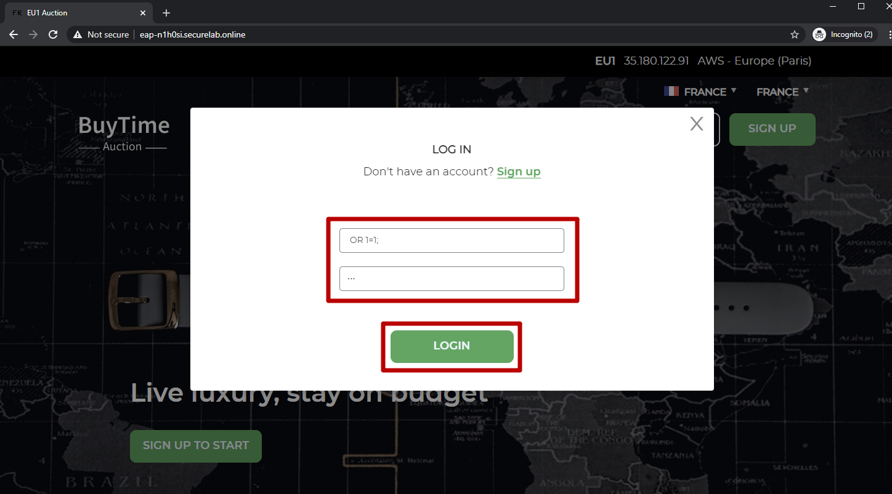
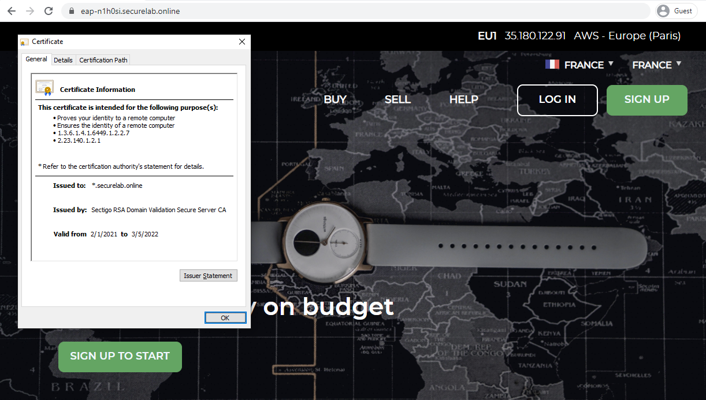

LAB: F5 Essential App Protect Service  
=========================================== 

.. contents:: Table of Contents   

Pre-Requisites
###############

- Any modern browser: for working with the UI (and this document)
- `Postman <http://bit.ly/309wSLl>`_ **(REQUIRED)**: for working with the API of the F5 Cloud Services & the Labs API

**NOTE (Existing F5 Cloud Services users only)**: If you originally signed up for F5 Cloud Services through a Limited User invitation (such as an email invite from another lab or from a different account owner), then it is possible that you haven't yet completed a full registration.

You can quickly tell if you have a full account by looking at your account(s) in the `F5 Cloud Services Portal <https://portal.cloudservices.f5.com/>`_. If you do now see any "Accounts you own:" and only see "Accounts you've been granted access to" as a **"Limited User"**, then you will need to create a full account & update user info before you can proceed with this lab. You can do so in step 3(c) below via the F5 Cloud Services API using the Postman request titled "Set User Info (optional)", the details of which are outlined below after the Login.

Lab Environment Overview
###############################

1. APIs and Services 
*********************

This Lab utilizes standard *F5 Cloud Services API*, as well as a *Lab Service API*, which was custom-built just for executing this lab: 

* **F5 Cloud Services API**: create, use, and remove the services in the scope of this lab 

* **Lab service API**: facilitates auxiliary functions for the lab only: creating DNS entries, sending targeted requests & traffic to the apps/services, etc.  

The following diagram captures the core components of this Lab: 

 .. figure:: _figures/Diagram.png

Lab Environment Setup  
############################### 

1. F5 Cloud Services Portal 
*************************** 

`a)` Login   

In order to use the F5 Essential App Protect service, you need access to F5 Cloud Services and be logged in with a valid user account. If you need to sign up, or if you already have one, proceed to the `F5 Cloud Services portal <http://bit.ly/f5csreg>`_.  

.. figure:: _figures/1-1.png  

Once you've logged in with an account, you will be using the user name and password values in the lab to authenticate with the F5 Cloud Services and the API.

`b)` Subscribe to Catalogs   

In order to access specific F5 Cloud Services, you need to subscribe to the corresponding service catalogs. The focus of this lab is on F5 Essential App Protect service, so you will need to subscribe to it. At the time of the writing of this lab you can take advantage of a 15-day free trial offer to work with this service -- no payment method required!

   `1.` Click on the **Your F5 Cloud** tab in the left navigation panel and you will see the available service catalogs, as well as services you have subscribed to, if any. For this lab you will need to subscribe to **Essential App Protect** service.   

   .. figure:: _figures/2-trial.png  

   `2.` You can also choose to subscribe to the service versus starting a free trial (if available). For full subscription you will need to provide payment information in the **Accounts** - **Payments** section, by adding a credit card, or alternatively subscribing through AWS Marketplace.    

   .. figure:: _figures/3.png  

   After successfully subscribing, your services will appear in the **Your F5 Cloud** tab. You will also see their current status.   

   .. figure:: _figures/4.png  

2. Postman Configuration  
************************** 

`a)` Download Postman `here <http://bit.ly/309wSLl>`_, open it, create a Postman account if you don’t have one and choose to do so, and sign in.  

`b)` Download collection **F5 Cloud Services EAP LAB.postman_collection.json** and environment **F5 Cloud Services EAP LAB.postman_environment.json** for Postman `here <https://github.com/f5devcentral/f5-cloudserviceeaplab/tree/master/postman>`_. Import them to your Postman.  

.. figure:: _figures/1.jpg  

You will now see your collection (left side) with calls in several categories, as well as environment variables (top right).  

.. figure:: _figures/91.png 

You are now ready to interface with the F5 Cloud Services using Postman. 

3. Fully Qualified Domain Name (FQDN) 
**************************** 

In order to create the Essential App Protect instance in the F5 Cloud Services portal, you need to have an FQDN. Use Postman and follow the steps below to get FQDN from the Lab service API.     

`a)` Open the “F5 Cloud Services EAP LAB” environment variables by clicking the “Environment Quick Look”, click into the field of the corresponding variable, and type the value of user email in the variable “USER_EMAIL” (click **Enter** after typing the values).  

.. figure:: _figures/114.png 

Repeat the same for the “USER_PASSWORD”.  

`b)` Select the **Login** request in the sidebar to login to your F5 Cloud Services profile and click **Send** to get the authorization token. More detailed information on this API request can be found `here <http://bit.ly/36ffsyy>`_.  

.. figure:: _figures/93.png 

A successful login will result in Postman returning the tokens from the API, shown in the response body below:  

.. figure:: _figures/84.jpg  

These tokens are then stored for subsequent calls using a function inside Postman to set environment variables. You can see the test function in the “Tests” tab:  

.. figure:: _figures/9.jpg  

**IMPORTANT NOTE**: If any of the subsequent Postman calls return a blank response or **"status": "unauthorized"** response (see the screenshot below), it means that your user token has expired and you simply need to re-login. To do that you just need to re-send the **Login** request using Postman to capture a new token.  

.. figure:: _figures/10.jpg  

`c)` OPTIONAL: Set User ID & Account Info 

You can skip this step for brand new accounts. 

**IMPORTANT NOTE**: If you originally signed up for F5 Cloud Services through a Limited User invitation (such as an email invite from another lab or from a different account owner), then it is possible that you haven't yet completed a full registration. You can quickly tell if you have by looking at your account(s) in the `F5 Cloud Services Portal <https://portal.cloudservices.f5.com/>`_ If you do now see any "Accounts you own:" and only see "Accounts you've been granted access to" as a **"Limited User"**, then you need to create a full account & update user info before you can proceed with this lab.

You can do this by running the following **Set User Info** API call, after you've updated the Body of the request with your own organization & address information:

.. figure:: _figures/237.jpg

The response returns the following detail, including your own organization account ID (id):

.. figure:: _figures/238.jpg

More information on this API request can be found `here <https://portal.cloudservices.f5.com/docs#operation/CreateAccount>`_.

At this point you should be a full user with an "Owned Account" and a primary organization account id, which can also be confirmed in the `F5 Cloud Services Portal <https://portal.cloudservices.f5.com/>`_ in the drop-down under your user name (top right), where you should see "Accounts you own:" and the Organization Account you created with **"Owner"** defined.

`d)` Retrieve User ID & Account ID

Select the **Get Current User** request and click **Send** to retrieve User ID and Account ID to be used in the further requests.  

.. figure:: _figures/86.jpg  

The response returns the following detail:  

.. figure:: _figures/12.jpg  

The retrieved User ID and Account ID are then stored for subsequent calls.  

.. figure:: _figures/11.jpg  

More detailed information on this API request can be found `here <http://bit.ly/37hyQw3>`_.  

`e)` Let’s now retrieve FQDN with the **Get FQDN Record type (lab)** API call. Click **Send**. This call will pass your “ACCESS_TOKEN” in the header of the request to the Labs API in order to get a record that will be used to create F5 Essential App Protect instance in the F5 Cloud Services portal.
Request:  

.. figure:: _figures/74.png  

The response will return your record name, its status, current type and IP. 

.. figure:: _figures/156.png

Note that at this stage our test application is using an A-record to route traffic that's going to the FQDN to the IP of the app server. During the lab we will update this DNS record to a CNAME generated during the Essential App Protect instance setup, so that the app traffic will directed to Essential App Protect instance first, and then the "scrubbed" traffic will be directed to our app IP (or FQDN) depending on the configuration.

When this request completes successfully the value of the FQDN Record will be captured as a variable:  

.. figure:: _figures/26.jpg  

Take note of this FQDN record; it will be used for creating Essential App Protect service in the F5 Cloud Services portal, as well as throughout the lab as the domain name for your test application. 

`f)` Test via Browser

Let's now look at your test application by browsing to the FQDN Record we just received.  Copy the "record" name from the previous Postman response and paste it into your browser.

.. figure:: _figures/115.png 

You will see the ficticious web app (BuyTime Auction website) which is currently not protected. This means all of the traffic is routed directly to the app server.  

.. figure:: _figures/230.png 

`g)` Get User Membership to F5 Cloud Services accounts

Back in Postman, let's send the **Get User Membership (optional)** request which returns info on your access to F5 Cloud Services accounts.

.. figure:: _figures/157.png

You will see account ids, names, roles and other information in the body of the response. 

.. figure:: _figures/158.png

Your "account_id" will be retrieved using the "account_name" value and will be used in the subsequent requests.

.. figure:: _figures/159.png

More detailed information on this API request can be found `here <http://bit.ly/2Gfu1r3>`_. 

`h)` Retrieve information on available catalogs and their IDs

Select the **Get Catalogs** request and click **Send** to retrieve the data about the available Catalogs and their IDs.

.. figure:: _figures/160.png

You can see the available catalogs:

.. figure:: _figures/161.png

The retrieved IDs are then stored for subsequent calls using a function inside Postman that sets environment variables. You can see the test function in the "Tests" tab of the request:

.. figure:: _figures/162.png

More detailed information on this API call can be found `here <http://bit.ly/36j1Yl4>`_. 

F5 Essential App Protect Service 
##################### 

1. Create F5 Essential App Protect Service via the F5 Cloud Services Portal  
************************************************************************ 

`a)` In order to create the Essential App Protect service, we need the FQDN Record info from a previously run API call. You can retrieve it by opening the **Get FQDN Record type (lab)** request in Postman and copying the value of the "record" key in the response.  

.. figure:: _figures/115.png

`b)` Go to the F5 Cloud Services portal, open the **Essential App Protect** tab and click **Start protecting your app**. 

.. figure:: _figures/116.png

`c)` Paste the record name you copied in step 1.a) above into "Fully Qualified Domain Name (FQDN)" field. The "Name this application" field will auto-populate; keep this value as-is for simplicity. The "Add a description" field is optional. Click **Save & Continue**.

.. figure:: _figures/117.png 

Essential App Protect does a FQDN lookup to retrieve the corresponding IP of the FQDN record, and will gather info on the location and geo-proximity of the nearest cloud region, and will display these as recommendations as to where to deploy the EAP instance. 

At this point, some users may want to select a different value in the drop-down for the EAP Region, which you can update/change at any time in the EAP instance settings after the instance setup.

**NOTE**: If after a minute you don't see the endpoint info, hit refresh and click "Complete Setup" to return to this step / see the info.

Click **Save & Continue**.  

.. figure:: _figures/118.png 

Note the info on the IP, City, State, and the Cloud Provider used by our test application. It also shows the region used by the cloud provider derived from the FQDN/IP information. As you can see in the screenshot, the example test app endpoint is located in North America, US East (N. Virginia) and is deployed on Amazon AWS. Note that the default configuration will be to route the traffic that's hitting the EAP instance to the identified IP address of the application endpoint.

`d)` You can now provide an SSL/TLS certificate, if you wanted to. However, for the lab at this point we will skip uploading the certificate and will come back to the certificate section later; for now only select "Enable HTTP Listener" with Port 80, and **uncheck** "Enable HTTPS Listener", then click **Save & Continue**.  

.. figure:: _figures/tls-ssl-v2.png 

`e)` Accept the defaults for all of the app protect features on the next screen and click **Save & Continue**. In case you need to update this property in the future, you can do so later in the **PROTECT APPLICATION** section.  

.. figure:: _figures/100.png 

`f)` Here take note of the CNAME value that's generated for your Essential App Protect instance. This is the value that we will use to point our test application's DNS record to; by changing it from an IP address to a CNAME. You should probably copy + paste it to a temporary document, but we'll also retrieve it through the UI and an API call later. Click **Done** and Essential App Protect service will be created and should be ready for use shortly.  

.. figure:: _figures/101.png  

**IMPORTANT**: Note that this process may take some time. You can check the status in the **All my applications** option of the dropdown menu: 

.. figure:: _figures/231.png 

`g)` Test via Browser 

When the setup finished and you see the instance is created, you can test the CNAME value that was provided. Select your newly-created EAP instance in the dropdown menu, go to the **PROTECT APPLICATION** tab, then **DNS Settings**  and copy the CNAME value.

.. figure:: _figures/232.png 

Paste it into your browser and you will be routed to the EAP instance, and then *scrubbed* traffic will flow to the IP of the app endpoint as captured during setup.

.. figure:: _figures/233.png 

Now that your Essential App Protect instance is created, we will update the DNS settings of our test app by switching the A-record (that previously pointed to the IP address of the app server) to the newly-created CNAME provided by the EAP setup. This way we will start routing all of the traffic that resolves the app's DNS record to Essential App Protect. Let's do that in the following steps! 

2. Update DNS Settings using CNAME  
******************************** 

`a)` Let's test if DNS settings are updated and the traffic is protected by Essential App Protect. In the F5 Cloud Services portal, open the **DNS Settings** tab in **PROTECT APPLICATION** and click **Test updated DNS**.

.. figure:: _figures/127.png 

As expected, it returns "DNS test failed" because we didn't update the CNAME value of our test app's record yet. Let's do that now.

`b)` Go back to Postman and use the **Get EAP Subscription** request to get the "subscription_id" and "CNAME" using your "ACCESS_TOKEN".

.. figure:: _figures/164.png

The response will return all information on your instance which we have created via UI: 

.. figure:: _figures/165.png

The retrieved CNAME will stored as a variables and will also be used to update the DNS settings:

.. figure:: _figures/166.png

More detailed information on this API request can be found `here <http://bit.ly/38xUHjc>`_.  

`c)` Send the **Update CNAME Record (lab)** request to update our test app's DNS Settings with the generated CNAME, which we captured in the UI earlier, and just now in the previous step using the API request as well:

.. figure:: _figures/167.png

The response will show the updated type ("CNAME") and value: 

.. figure:: _figures/168.png

`d)` Let's now re-send the **Get FQDN Record type (lab)** request to see the current type of the record. 

.. figure:: _figures/129.png

The response will show that record type is changed from "A" to "CNAME" (see step 3.d) above), as well as "value" is updated, which means that app traffic now goes through Essential App Protect instance and is actively protected.   

.. figure:: _figures/128.png

`e)` Test CNAME change via UI   

Return to the F5 Cloud Services portal, open the **Essential App Protect** tab, select your app from the dropdown menu and click **PROTECT APPLICATION**. Then open the **DNS Settings** tab and click **Test updated DNS**.  

.. figure:: _figures/106.png 

You will see successful status of testing.

`f)` Test via Browser

Let's now test the updated DNS setting via browser. Return to the F5 Cloud Services portal, open the **General** tab and copy the FQDN.

.. figure:: _figures/234.png

Paste it into your browser and you will see the NA2 instance of the Auction website and all of the requests will now be flowing through the Essential App Protect, which means your app is now protected. However, any malicious requests will not be blocked, as we have not turned on "Blocking" mode yet.

.. figure:: _figures/131.png

3. Review the JSON via UI 
******************

If you would like to see the full configuration of your Essential App Protect or edit some properties, you can review the JSON either via UI or via Postman. If you prefer to do that via Postman, then proceed to the next section. 

In order to view the JSON via the F5 Cloud Services portal, open **PROTECT APPLICATION** and go to the **JSON configuration** tab. 

.. figure:: _figures/132.png

Let's take a look at different sections available in the JSON. In order to collapse or expand a section, click the small arrows next to the line numbers. 

The main sections are "application" and "policy".

.. figure:: _figures/133.png

In the "application" section, we can see our FQDN, region our instance belongs to, IP endpoints  and port. 

.. figure:: _figures/134.png

In the "policy" section, we can learn all the information about our protection and its settings, as well as about each attack type.

.. figure:: _figures/135.png

More detailed information on attack types can be found in Section 5 below. 

4. Review the JSON via Postman 
*******************************

If you prefer to use Postman to review the JSON, go back to Postman and send the **Get JSON** request:

.. figure:: _figures/136.png

The response will retrieve the JSON containing all the Essential App Protect instance information: 

.. figure:: _figures/137.png

The returned JSON provides some general information on subcription_id, user_id, and instance name, as well as all configuration details (CNAME, FQDN, etc) and protection settings. 

.. figure:: _figures/169.png

More detailed information on this API request can be found `here <http://bit.ly/38xUHjc>`_.  

5. Attacks  
*********** 

There are three types of attacks:  

`1)` SQL Injection 

This attack inserts a SQL query via the input data field in the web application. Such attacks could potentially read sensitive data, modify and destroy it. More detailed information can be found `here <http://bit.ly/2RfmXkw>`_.

`2)` Illegal Filetype 

This attack combines valid URL path segments with invalid input to guess or brute-force download of sensitive files or data. More detailed information can be found `here <http://bit.ly/30NrAFF>`_.  

`3)` Threat Campaign 

These types of attacks are the category that F5 Labs tracks as coordinated campaigns that exploit known vulnerabilities. This particular attack simulates using a known Tomcat backdoor vulnerability. The complete list of such threats can be found `here <http://bit.ly/36bPmfG>`_.   

Let’s now simulate an attack.

Go back to Postman and send the **Attack: Illegal Filetype** request. 

.. figure:: _figures/170.png

You can see the status of the attack in the **VIEW EVENTS** section of the F5 Cloud Services portal.

.. figure:: _figures/138.png

As you see, our "Illegal file type" attack has appeared on the list and its status is "Not blocked" for now.  

6. Update Monitoring to Blocking via UI 
*************************************** 

For now all the threats of your app are only monitored without any actions taken. You can change monitoring to blocking both via the F5 Cloud Services portal and via Postman. Let's change monitoring to blocking for High-risk Attack Mitigation via the F5 Cloud Services portal, and for Malicious IP and Threat Campaigns via Postman in the next section. 

`a)` In order to start blocking attacks, go to the **PROTECT APPLICATION** tab, then open **High-risk Attack Mitigation** and toggle **Blocking Mode** on. Click **Update**:  

.. figure:: _figures/105.png 

`b)` Testing the status 

Now that the protection mode is "blocking" for **High-risk Attack Mitigation**, you can re-send the **Attack: Illegal Filetype** request in Postman. After that go back to the F5 UI, open **VIEW EVENTS** and you will see the new attack with the "Blocked" status:

.. figure:: _figures/119.png

Note that its status is also updated in the **PROTECT APPLICATION** data card. 

7. Update Monitoring to Blocking via Postman 
******************************************** 

Let's now change monitoring to blocking for Malicious IP and Threat Campaigns via Postman.

`a)` Go back to Postman and send the **Update Monitor to Block** request which uses your “account_id” and "EAP record" retrieved a few steps above. 

.. figure:: _figures/173.png

You will see the updated "blocked" status of attacks in the response. 

.. figure:: _figures/174.png

You can also notice that their status changed in the F5 UI:

.. figure:: _figures/139.png

More detailed information on this request can be found `here <https://bit.ly/3ckOJVA>`_. 

`b)` Testing the status 

Now that the protection mode is "blocking" for all the attacks, you can send the **Attack: Threat Campaign** request in Postman:

.. figure:: _figures/171.png

Also send the **Attack: SQL Injection** request:

.. figure:: _figures/172.png

After that go back to the F5 UI, open **VIEW EVENTS** and you will see the new attacks with the "Blocked" status:

.. figure:: _figures/175.png

8. Geolocation Enforcement via UI
****************************

You can create a list of countries traffic from which will be blocked via UI or via Postman. If you prefer to do so via Postman, proceed to the next section.

`a)` Go back to the F5 Cloud Services portal, the **PROTECT APPLICATION** tab, then go to **High-risk Attack Mitigation**  and click 
**Deny requests from specific countries**. This will activate the **Manage countries** button.   

.. figure:: _figures/142.png

`b)` Now click the **Manage countries** button:

.. figure:: _figures/228.png

`c)` Let's add France as a country whose requests you want to deny and click **Update**.

.. figure:: _figures/143.png

`d)` If you prefer to deny requests from OFAC-sanctioned countries without creating your own list, just tick the option in the F5 Cloud Servcies portal and **Update**.

.. figure:: _figures/140.png
 
9. Geolocation Enforcement via Postman
****************************

`a)` If you would like to block requests on a country-basis via Postman, then send the **Block country list** request which will use your "account_id" and "EAP record":

.. figure:: _figures/176.png 

The response will show the countries blocked: 

.. figure:: _figures/149.png

More detailed information on this request can be found `here <https://bit.ly/3ckOJVA>`_. 

`b)` Let's now go to the F5 Cloud Services portal and see the updated geolocation enforcement:

.. figure:: _figures/120.png  

Click **Manage countries** to see the countries that are blocked: 

.. figure:: _figures/121.png

`c)` Let's test how the country-basis blocking works. Go back to Postman and send the **Test Country Blocking (lab)** request which uses your "EAP record". 

.. figure:: _figures/177.png

Let's open the F5 UI and go to **VIEW EVENTS** section to see the newly blocked attack based on geolocation: 

.. figure:: _figures/178.png

10. Update IP Enforcement Rules via UI  
********************************

If you need to block specific IP addresses or add them to the whitelist, you can do it in two ways: via Postman or UI. If you prefer to do it via Postman, then proceed to the next section. If your choice is UI, then follow the steps below: 

`a)` Go to **PROTECT APPLICATION**-> the **High-risk Attack Mitigation** tab and click **Manage Rules**. 

.. figure:: _figures/150.png

`b)` Add "34.229.48.248" IP for blocking and "77.120.157.224" IP to the whitelist. Add a short description for each, tick those which you prefer to be logged and click **Update**. 

.. figure:: _figures/151.png

11. Update IP Enforcement Rules via Postman  
********************************

`a)` Go to Postman and send the **Update IP Enforcement Rules** request which uses your "account_id" and "EAP record".

.. figure:: _figures/122.png

In the response you will see four blocked and one allowed IPs. 

.. figure:: _figures/152.png

More detailed information on this request can be found `here <https://bit.ly/3ckOJVA>`_. 

12. Customize Blocked Page 
***************************

If you prefer to customize your blocked page acc to your wish, you can do it using Postman. 

`a)` First, let's see the page prior to sending the request. To do that, let's simulate an attack via the browser. Paste "**Fully Qualified Domain Name (FQDN)**/nginx.config" address to your browser. The result will be the following:

.. figure:: _figures/124.png 

`b)` Go back to Postman and send the **Customize blocked page** request which uses your **account_id** and **EAP record**. 
 
.. figure:: _figures/179.png 

`c)` Refresh the page in the browser opened one step above and you will see:

.. figure:: _figures/125.png 

**Note**: It may take  some time due to updating the service. 

13. Add New Endpoints 
*********************

Let's imagine your website is to function both in the USA and in Europe which requires two endpoints. But for now, you have only one IP endpoint added to Essential App Protect - North America, US East (N. Virginia). 

.. figure:: _figures/180.png 

If you need to add the second one, say, in Europe, you can do it via Postman.

Send the **Add new endpoints** request in Postman: 

.. figure:: _figures/181.png 

You will see the Endpoint added in the returned response located in Europe and deployed on AWS:

.. figure:: _figures/182.png 

More detailed information on this request can be found `here <https://bit.ly/3ckOJVA>`_. 

You will also see the new endpoint in the F5 Cloud Services portal:

.. figure:: _figures/183.png 

Note that this operation may take up to a few minutes due to its deployment. 

14. Test New Endpoint via Postman
***********************************

Let's now test the endpoint we've just created via Postman.

Send the **Test Second Endpoint (lab)** request: 

.. figure:: _figures/186.png 

Here's what you should see in the response:

.. figure:: _figures/187.png 

15. Attacks via Browser 
*************************

Let's now simulate some attacks via browser and follow them in the dashboard of the F5 Cloud Services portal. 

`a)` In order to simulate Illegal File type, paste "**Fully Qualified Domain Name (FQDN)**/nginx.config" address to your browser and the page will be blocked:

.. figure:: _figures/153.png 

Now let's go back to the F5 Cloud Services portal and see the dashboard with the new attack:

.. figure:: _figures/154.png 

You can see the type of attack and some more detailed information in the **VIEW EVENTS** tab:

.. figure:: _figures/155.png 

`b)` Let's now simulate SQL Injection attack via browser and our "BuyTime Auction" app. Copy your FQDN from the F5 Cloud Services portal and paste in your browser. 

Fill in **' OR 1=1; '** as login  and fill in any password. Click **Login**.

And you will see that SQL Injection attack is blocked.  

.. figure:: _figures/189.png 

You can see the details of this attack in the **VIEW EVENTS** tab in the F5 Cloud Services portal:

.. figure:: _figures/190.png 

16. Check the Map
****************

Now let’s see the map of our attacks on the F5 Cloud Services portal. You need to select the **MONITOR APPLICATION** tab where you will see the dashboard.

You can see our latest attacks on the map:

.. figure:: _figures/191.png 

If you wish to see more detailed information, you can hover over a specific attack and its information will appear:

.. figure:: _figures/192.png 

To the left of the map, you can see the legend showing the number of application endpoints and their details, as well as different types of attacks shown on the map. 

.. figure:: _figures/215.png 

The yellow lines on the map show the attacks within the last five minutes. 

17. Start Attacks via Postman 
*************************

`a)` Let’s now return to Postman and simulate the attacks by sending the **Start EAP Attack (lab)** request.

.. figure:: _figures/193.png 

And the response will be "ok" which means that attacks have been activated:

.. figure:: _figures/194.png 

`b)` Check the map

Let’s go back to the F5 Cloud Services portal and check the map in the **MONITOR APPLICATION** tab. 

You can see our two endpoints and the latest attacks on the map:

.. figure:: _figures/200.png 

If an endpoint is being attacked at the moment, the type of attack is shown over it. You can see it by hovering over:

.. figure:: _figures/203.png 

In **MONITOR APPLICATION** you will find information on malicious requests received by the application. The histogram shows the history of malicious activity over the last two hours in five-minute increments. The donut chart shows the percentage of malicious requests blocked during the last time period, as well as the specific numbers of blocked and not blocked requests.

.. figure:: _figures/201.png 

In case you need to zoom in some cluster of attacks, just click on an attack cluster and the map will be zoomed in:

.. figure:: _figures/202.png 

18. View Events via Postman  
************************

Now return to Postman to get more detailed information on the simulated attacks. Send the **Get EAP Events Stream** request which uses “subscription_id” and “service_instance_id”.

.. figure:: _figures/195.png 

You can see different attack characteristics in the response, including number, type, country, source IPs, etc.

.. figure:: _figures/196.png

More detailed information on this request can be found `here <https://bit.ly/2VttrPh>`_. 

19. View Events via UI  
**************************** 

You can also see the attacks via UI. All the detailed information can be found in the **VIEW EVENTS** tab of the F5 Cloud Services portal. 

.. figure:: _figures/197.png 

You can also set some specific rules for each attack and its IP individually:

.. figure:: _figures/111.png 

20. Specify SSL Certificate via Postman
***************************

When creating Essential App Protect instance in one of the steps above, we skipped providing an SSL/TLS certificate. Let's now get and implement it via Postman. 

`a)` Let's send the **Get SSL Certificate (lab)** request:

.. figure:: _figures/204.png 

You will get the certificate information in the response:

.. figure:: _figures/205.png 

The retrieved certificate details are then stored for subsequent calls using a function inside Postman. You can see the test function in the Tests tab:

.. figure:: _figures/206.png 

`b)` Now we'll upload the certificate to the F5 Cloud Services portal. In order to do that, send the **Upload SSL Certificate** request:

.. figure:: _figures/207.png 

The response will return the certificate ID which will be used for updating the certificate in the portal:

.. figure:: _figures/208.png 

`c)` The next step will associate the certificate with the Essential App Protect app. In order to do that, send the **Update EAP SSL Certificate** request from Postman which uses certificate ID retrieved above:

.. figure:: _figures/209.png 

The response shows all the information regarding instance the certificate is connected to:

.. figure:: _figures/210.png 

`d)` Now we need to restart our instance for the certificate to become active. 

   `1.` In order to do that, go back to Postman and send the **Suspend EAP Subscription** request:
   
   .. figure:: _figures/212.png 
   
   In the response you will see new "disabled" status:
   
   .. figure:: _figures/213.png 
   
   Note that this operation may take some time. Proceed to the next step after the status of your instance is changed to "Inactive" in the F5 Cloud Services portal. The status can be seen in the **All my applications** option of the dropdown menu.
   
   .. figure:: _figures/235.png
   
   `2.` Let's now activate the service with the SSL certificate. Send the **Activate EAP Subscription** request:
   
   .. figure:: _figures/214.png 
   
   And the response will return the updated status:
   
   .. figure:: _figures/216.png 
   
   Note that this operation may take some time. Proceed to the next step after the status of your instance is changed to "Active" in the F5 Cloud Services portal. The status can be seen in the **All my applications** option of the dropdown menu.
   
   .. figure:: _figures/236.png 
   
`e)` Check SSL Certificate via UI

Let's now check the certificate via UI. Open **PROTECT APPLICATION** and go to the **General** tab. You will see the uploaded and updated certificate: 

.. figure:: _figures/211.png 

`f)` Now we can check our "BuyTime Auction" app with the SSL certificate via browser. Copy your FQDN from the **General** tab in the F5 Cloud Services portal and paste to your browser starting with "**https://**". 

You can see that the connection is safe. Now let's click the **Certificate** and see its details:

Clean Up  
######## 

At this point feel free to explore and repeat any of the previous steps of the lab, but should you want to clean up the resources you've created and remove your services, then follow the steps below.

`1.` Clean Up via Postman
*************************

`a)` In order to clean up Essential App Protect instance we've created and remove the subscription, send the **Retire EAP Subscription** request which uses the relevant “subscription_id”:

.. figure:: _figures/219.png
 
You will see “retired” status in the response body which means that it’s not available on the F5 Cloud Services portal anymore.
 
.. figure:: _figures/220.png
  
More detailed information on these API requests can be found `here <http://bit.ly/2Gf166I>`_.  

`b)` Change Essential App Protect Record type 

Let's send the **Reset EAP Record (lab)** request to change record type from CNAME to A back:

.. figure:: _figures/222.png
 
The request will show the reset type and IP value:

.. figure:: _figures/223.png

`2.` Clear Tokens from the Lab Service API
******************************************
 
We recommend that you clear your tokens from the Lab Service API for security purposes. In order to do that, send the **Logout** request, which uses your ACCESS_TOKEN:
 
.. figure:: _figures/224.png
 
You will get the following response with the status showing "200 OK":
 
.. figure:: _figures/225.png
 
Your ACCESS_TOKEN will be considered invalid:
 
.. figure:: _figures/226.png

More detailed information on these API requests can be found `here <https://bit.ly/2VttrPh>`_.  
